# 🧰 Solo Suite

> A unified productivity platform built for student entrepreneurs and solo creators.

---

## 🧠 Project Description

**Solo Suite** is an AI-powered productivity and collaboration platform built with Next.js and React. It enables service providers and clients to manage tasks, post jobs, showcase portfolios, export invoices, and collaborate seamlessly — all in one unified workspace.

### 💡 How We Solve the Problem

- **🎯 Dual-role Access System**  
   Offers separate, role-specific dashboards for **Service Providers** and **Clients**, ensuring personalized experiences and relevant tools for each.
- **🧠 Smart AI Taskboard**  
   Enables providers to generate tasks from brief descriptions, receive intelligent suggestions, and gain actionable progress insights — powered by integrated AI.

- **🤝 Simplified Client-Provider Workflow**  
   Clients can easily post jobs, accept proposals, and search for providers, making collaboration fast, transparent, and centralized.

- **💼 Portfolio Showcase**  
   Providers can build and display their portfolio to attract new clients and stand out in the integrated marketplace.

- **📅 Export Capabilities**  
   Tasks can be exported to calendar apps, and invoices can be downloaded as PDFs — making organization and billing seamless.

- **🌐 Built-in Job Marketplace**  
   Helps providers discover and apply for new opportunities without leaving the platform.

- **⚙️ AI-powered Productivity Tools**  
   Features like AI-generated to-dos, smart scheduling, and email assistance enhance daily operations and reduce manual work.

---

## 🚀 Features & Innovations

- **🧠 AI Schedule Optimizer** – Automatically generates and adjusts weekly plans and to-dos.
- **⏱️ Smart Task Estimator** – Predicts task durations and flags urgency with color zones.
- **📥 Client Request Analyzer** – Analyzes and categorizes client needs.
- **📊 Productivity Insights** – AI-powered summaries and personalized productivity suggestions.

---

## 🛠 Tech Stack

### Frontend
- React (with TypeScript)
- Next.js (App Router, Client & Server Components)
- Tailwind CSS
- ShadCN UI

### Backend
- Supabase (Auth, Database, API, File Storage)
- PostgreSQL (via Supabase)

### AI Features
- Groq APIs (for intelligent text analysis, task/todo generation)

---

## ⚙️ Setup Instructions

> Basic setup instructions (temporary – to be expanded as development continues)

1. **Clone the repo**  
   ```bash
   git clone https://github.com/HackSomeThorns-2025/Dreadful_APIs.git
   cd Dreadful_APIs
   ```

2. **Install dependencies**  
   ```bash
   npm install
   ```

3. **Set Up Environment Variables**
   ``` 
   touch .env.local

   Supabase
   NEXT_PUBLIC_SUPABASE_URL=your_supabase_url
   NEXT_PUBLIC_SUPABASE_ANON_K   =your_supabase_anon_key

   # OpenAI or other AI provider (if used)
   OPENAI_API_KEY=your_openai_key

   # Optional: AI provider switch
   MODEL_PROVIDER=openai # or gemini, groq, etc.

   ```

4. **Run the development server**  
   ```bash
   npm run dev
   ```

4. **(Optional)** Set up your Supabase project and environment variables.


---

## 📦 Dependencies

> A minimal list for now (auto-generated in package.json, to be finalized):

- `react`, `nextjs`, `typescript`, `tailwindcss`  
- `@shadcn/ui`  
- `@supabase/supabase-js`  
- `lucide-react`  
- `dotenv` (for local env config)
- `Groq AI`

---

## 👥 Team Details

**Team Name:** Dreadful APIs  
A duo of tech enthusiasts building meaningful productivity tools.

| Name               | Stream             | Registration No. |
|--------------------|---------------------|-------------------|
| Kashyap Datta Dhondu | Computer Science     | 230905392         |
| Manas Goel         | Data Science        | 230968160         |

---

## 🔁 Workflow Explanation

```mermaid
graph TD

%% Entry Point
A[🔐 Dual Login System] --> B[👤 Provider Dashboard]
A --> C[🧑‍💼 Client Dashboard]

%% Provider Side Features
B --> B1[🧠 Smart Taskboard]
B1 --> B1a[📝 Generate Tasks]
B1 --> B1b[💡 Task Suggestions]
B1 --> B1c[📊 Progress Insights]

B --> B2[🧾 Export Features]
B2 --> B2a[📅 Export to Calendar]
B2 --> B2b[📄 Export Invoices to PDF]

B --> B3[💼 Portfolio Showcase]
B --> B4[🌐 Find Jobs in Marketplace]

%% Client Side Features
C --> C1[📢 Post Jobs]
C --> C2[✅ Accept Requests]
C --> C3[🔍 Search Providers]
```



---

## 🔗 Important Links

- [Supabase](https://supabase.com/)
- [Next.js](https://nextjs.org/)
- [Tailwind CSS](https://tailwindcss.com/)
- [Groq API](https://console.groq.com/keys)
- [ShadCN UI](https://ui.shadcn.com/)

---


