# 🧰 Solo Suite

> A unified productivity platform designed for student entrepreneurs and solo creators.

---

## 🧠 Project Description

**Solo Suite** is a clean, all-in-one workspace where service providers and clients can plan, collaborate, showcase, and grow. Built using modern web technologies, it merges powerful features like task management, job boards, portfolio displays, and AI assistance — all in a single platform.

---

## 💡 Key Highlights

- **🎯 Dual-role Dashboards**  
  Tailored dashboards for **Providers** and **Clients**, giving each role the tools they need without extra noise.

- **🧠 Smart AI Taskboard**  
  Auto-generates tasks from plain input, provides suggestions, and gives progress insights.

- **🤝 Streamlined Job Collaboration**  
  Post jobs, accept proposals, manage reviews, and communicate — all in one place.

- **💼 Portfolio & Reviews**  
  Providers can build detailed portfolios with real-time average ratings, review cards, and context.

- **📅 Export Options**  
  Export to-dos to calendar apps, download PDF invoices, and more.

- **🌐 Built-in Marketplace**  
  Browse, bookmark, and apply to job opportunities without leaving the suite.

- **🔖 Saved Jobs & Bookmarks**  
  Quick access to favorite listings for future use.

- **🧾 Transparent Reviews**  
  Once a job is reviewed, it’s always marked accordingly — building trust and accountability.

---

## 🚀 Features & Innovations

- **AI Schedule Optimizer** – Weekly plan generator and smart to-do assistance.
- **Smart Task Estimator** – Time predictions and urgency cues.
- **Client Request Analyzer** – Categorizes and interprets job posts.
- **Productivity Insights** – AI suggestions to improve workflow.
- **Real-time Reviews** – Integrated with portfolios.
- **Saved Bookmarks** – Revisit and act on important job posts.
- **Persistent Statuses** – Reviewed = Reviewed. Always.
- **Sleek UI** – Gradient badges, responsive layouts, and clean typography.

---

## 🛠 Tech Stack

**Frontend**
- React (TypeScript)
- Next.js (App Router)
- Tailwind CSS
- ShadCN UI

**Backend**
- Supabase (Auth, DB, API, Storage)
- PostgreSQL (via Supabase)

**AI**
- Groq APIs (for task & text intelligence)

---

## ⚙️ Setup Instructions

1. **Clone the repository**

   ```bash
   git clone https://github.com/HackSomeThorns-2025/Dreadful_APIs.git
   cd Dreadful_APIs
   ```

2. **Install project dependencies**

   ```bash
   npm install
   ```

3. **Set environment variables**

   Create `.env.local` and add:

   ```
   NEXT_PUBLIC_SUPABASE_URL=your_supabase_url
   NEXT_PUBLIC_SUPABASE_ANON_KEY=your_supabase_anon_key
   OPENAI_API_KEY=your_openai_key
   MODEL_PROVIDER=openai # or gemini, groq, etc.
   ```

4. **Run locally**

   ```bash
   npm run dev
   ```

---

## 📦 Dependencies

- react, next.js, typescript, tailwindcss  
- @shadcn/ui  
- @supabase/supabase-js  
- lucide-react  
- dotenv  
- Groq AI  

---

## 👥 Team Details

**Team:** Dreadful APIs  
_Just two students building something useful._

| Name                 | Department        | Reg. No.     |
|----------------------|-------------------|--------------|
| Kashyap Datta Dhondu | Computer Science  | 230905392    |
| Manas Goel           | Data Science      | 230968160    |

---

## 🔁 Workflow Overview

```mermaid
graph TD

A[🔐 Dual Login System] --> B[👤 Provider Dashboard]
A --> C[🧑‍💼 Client Dashboard]

B --> B1[🧠 Smart Taskboard]
B1 --> B1a[📝 Generate Tasks]
B1 --> B1b[💡 Task Suggestions]
B1 --> B1c[📊 Progress Insights]

B --> B2[🧾 Export Features]
B2 --> B2a[📅 Export to Calendar]
B2 --> B2b[📄 Export Invoices to PDF]

B --> B3[💼 Portfolio Showcase]
B --> B4[🌐 Find Jobs in Marketplace]
B --> B5[🔖 Saved Jobs]
B --> B6[🌟 Dynamic Reviews]

C --> C1[📢 Post Jobs]
C --> C2[✅ Accept Requests]
C --> C3[🔍 Search Providers]
C --> C4[🤝 Providers Worked With]
C4 --> C4a[📝 Leave Review]
C4 --> C4b[🟢 Persistent Review Status]
```



---

## 🔗 Useful Links

- [Supabase](https://supabase.com)
- [Next.js](https://nextjs.org)
- [Tailwind CSS](https://tailwindcss.com)
- [Groq API](https://console.groq.com/keys)
- [ShadCN UI](https://ui.shadcn.com)

---

_This README will evolve as the product does. Contributions and stars appreciated!_
